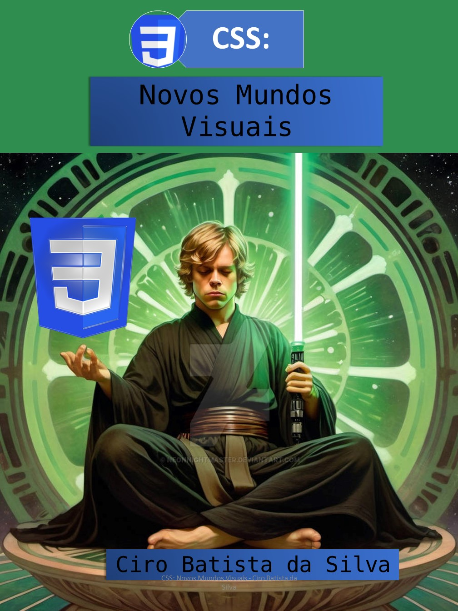
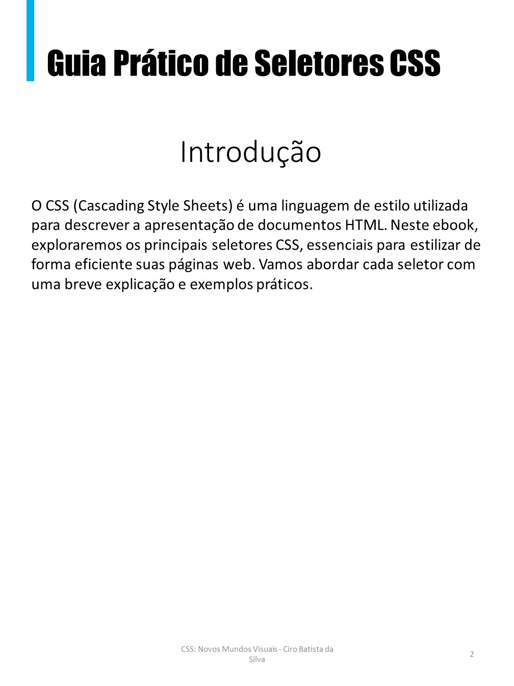
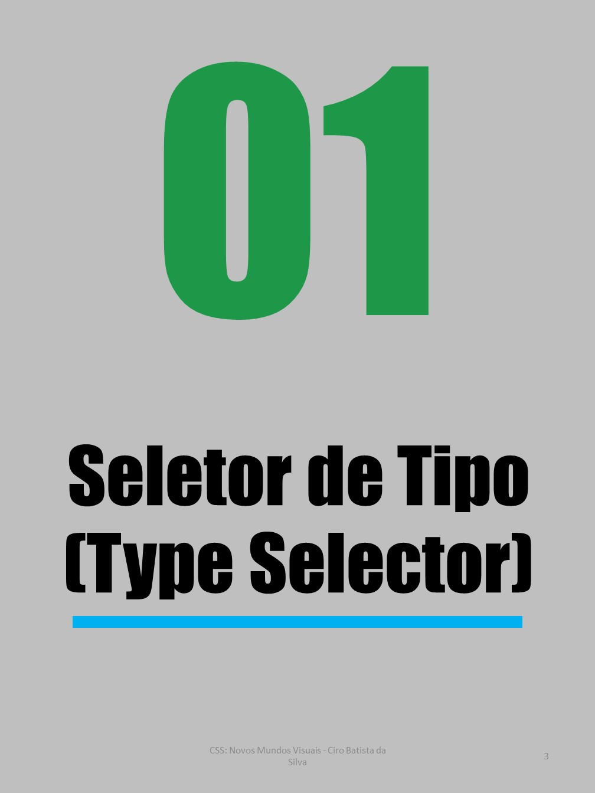
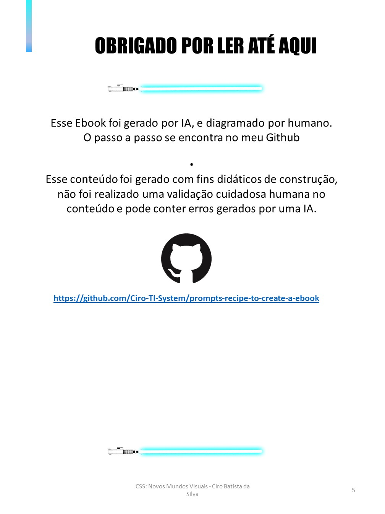

<h1 align="center"> 
Projeto EBOOK Gerado por I.A.s
</h1>

⚙️ Projeto com o objetivo de gerar um ebook digital com as facilidades das ferramentas de IA. ⚙️

 

  
  

 

  
  

 

  

 

## 🛠 Tecnologias

Esse projeto foi desenvolvido com as seguintes tecnologias:

- **[ChatGPT](https://chat.openai.com/)**
- **[MidJourney](https://www.midjourney.com/app/)**
- **[PowerPoint](https://www.microsoft.com/en/microsoft-365/powerpoint)**

 

## 🧠 Prompts

ChatGPT：

|   Ação   | prompt                                                                                                                                                                                                                                                                         |
| :------: | ------------------------------------------------------------------------------------------------------------------------------------------------------------------------------------------------------------------------------------------------------------------------------ |
|  título  | Crie um título de um ebook sobre o tema de css, o e-book é do nicho de programação e o sub-nicho é de css, o título deve ser épico e curto, e tenha uma temática de star wars no título, me liste 5 variações de títulos                                                       |
| conteúdo | Faça um texto para ebook , com foco em CSS, listando os principais seletores CSS com exemplos em código {REGRAS} Explique sempre de uma maneira simples Deixe o texto enxuto, Sempre traga exemplos de código em contextos reais , sempre deixe um título sugestivo por tópico |

Midjourney：

|  Ação  | prompt                                                                                  |
| :----: | --------------------------------------------------------------------------------------- |
| título | A Jedi in meditation pose, with your blue light saber floating, pixel art style --v 5.1 |

## ✨ Features

- Conteúdo gerado via ChatGPT
- Imagens geradas via MidJourney

## 📚 Materiais

- Imagens utilizadas em `assets`
- ebook gerado durante as aulas em `output`

## 🛠️ Instruções de execução

Utilize os prompts acima nas ferramentas sugeridas para gerar o material base e utilize uma ferramenta de edição de documentos como power point, libre office , inDesign para diagramação.
 

## 📝 License

  

Esse projeto está sob a licença MIT.

 

### 👨‍💻 Autor

 
 <em>Ciro Batista da Silva<em>
 
  

 
👋🏽 Entre em contato!

 

